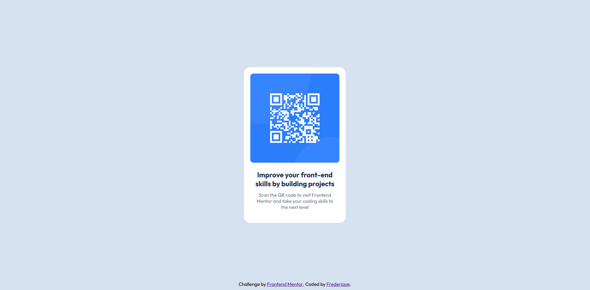

# Frontend Mentor – Solution du composant QR Code
L'objectif est de créer une carte contenant un QR code en HTML et CSS, en suivant fidèlement le design fourni.
Ce projet ne demandait pas de mise en page responsive.

Ceci est ma solution concernant ce projet (https://www.frontendmentor.io/challenges qr-code-component-iux_sIO_H). 

Les challenges de Frontend Mentor m’aident à améliorer mes compétences en HTML et CSS en réalisant des projets concrets.

## 📸 Capture d’écran

## 🔗 Liens

- Code source : [https://github.com/oxford777/qr-code-component](https://github.com/oxford777/qr-code-component)
- Site en ligne : *(#### GitHub Pages)*

### 🔧 Construit avec

- HTML5 
- CSS3 (Flexbox)
- Google Fonts (Outfit)

### 💡 Ce que j’ai appris

Ce projet m’a permis de pratiquer les bases du HTML et du CSS, notamment :

- Centrer un élément avec Flexbox (`justify-content` + `align-items`)
- Appliquer un design précis avec des unités comme `rem` 
- utiliser le système HSL pour les couleurs

### 🧭 Pistes de développement futur

- Ajouter une version responsive pour les petits écrans
- Animer légèrement la carte avec un "hoover"
- Explorer davantage les unités relatives ("em", "vh")

### 📚 Ressources utiles

- [Guide Flexbox – CSS Tricks](https://css-tricks.com/snippets/css/a-guide-to-flexbox/)
- [MDN - CSS values and units](https://developer.mozilla.org/fr/docs/Learn_web_development/Core/Styling_basics/Values_and_units)

## 👤 Auteur

- Prénom : Frédérique
- GitHub : [@oxford777](https://github.com/oxford777)

## 🙏 Remerciements

Merci à Frontend Mentor pour ce projet formateur.  
